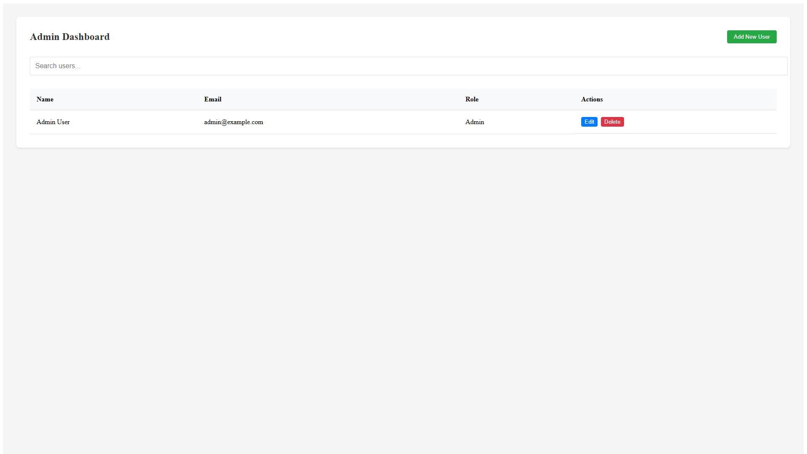

# Angular-NET-Core-CRUD

## Table of Contents
1. [About the Project](#about-the-project)
2. [Built With](#built-with)
3. [Getting Started](#getting-started)
   - [Prerequisites](#prerequisites)
   - [Installation](#installation)
4. [Usage](#usage)
   - [Running the Backend](#running-the-backend)
   - [Running the Frontend](#running-the-frontend)
5. [Features](#features)
6. [API Documentation](#api-documentation)
7. [Contributing](#contributing)
8. [Authors](#authors)
9. [Acknowledgements](#acknowledgements)
10. [License](#license)

## About the Project


The Angular-NET-Core-CRUD project is a full-stack web application that allows users to manage a user database. It consists of a .NET Core backend API and an Angular frontend.

The key features of the project include:
- JWT-based authentication with role-based authorization (Admin and User roles)
- User management CRUD operations
- Responsive and intuitive user interface

## Built With
- .NET Core 8
- Angular 16
- Entity Framework Core
- JWT Authentication
- Swagger for API documentation

## Getting Started

### Prerequisites
- [.NET SDK 8.0+](https://dotnet.microsoft.com/en-us/download)
- [Node.js 16+](https://nodejs.org/en/)
- [Angular CLI 16+](https://angular.io/cli)

### Installation
1. Clone the repository:
   ```sh
   git clone https://github.com/HunterX-7/Angular-NET-Core-CRUD.git
2. Navigate to the project directory:
    ```sh
    cd Angular-NET-Core-CRUD
3. Navigate to the backend API project:
    ```sh
    cd API
4. Restore the .NET Core dependencies:
    ```sh
    dotnet restore
5. Navigate to the frontend project:
    ```sh
    cd ../client
6. Install the Angular dependencies:
    ```sh
    npm install
## Usage

### Running the Backend
1. Navigate to the API project:
    ```sh
    cd API
2. Start the backend API:
    ```sh
    dotnet build
3. The API will be available at `https://localhost:5277/swagger`.
    ```sh
    dotnet run
### Running the Frontend
1. Navigate to the client project:
    ```sh
    cd client
2. Start the Angular development server:
    ```sh
    ng serve
3. The frontend will be available at `http://localhost:4200`.

### Testing Credentials
For testing purposes, you can use the following admin credentials:
- Email: admin@example.com
- Password: admin123

> **Note**: These are default testing credentials. For production environments, ensure these are changed and proper security measures are implemented.

## Features
- JWT-based authentication with role-based authorization
- Admin users can perform CRUD operations on all users
- Regular users can view and update their own profile
- Responsive and intuitive user interface

## API Documentation
The API documentation is generated using Swagger and is available at `https://localhost:5277/swagger` when the backend is running.

## Contributing
Contributions, issues, and feature requests are welcome! Feel free to check the [issues page](https://github.com/HunterX-7/Angular-NET-Core-CRUD/issues).

## Authors
- **Francisco Quintero** - *Initial work* - [GitHub Profile](https://github.com/HunterX-7)

## Acknowledgements
- Hat tip to anyone whose code was used

## License
This project is licensed under the [MIT License](LICENSE).
